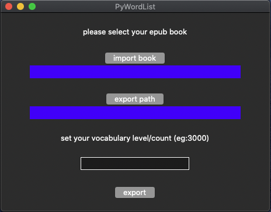

`PywordList` can help you export english word list from a `epub` book.
you can check [exported xlsx](https://github.com/ebookwordlist/PyWordList/blob/master/resource/pg1342.xlsx) to get the point

开源了一个小工具:从epub 电子书导出单词表。有如下特性:
- 单词按照书中的章节分组
- 按照用户的词汇量过滤单词
- 单词可按照书中出现顺序，或者词频进行排序(方便预习和复习)
- app只支持macOS ,脚本是纯python写的
- 导出文件为excel文件

欢迎大家使用

### Download app
For macos user
you can download app directly [release](https://github.com/ebookwordlist/PyWordList/releases)
### Download script 
```
git clone https://github.com/ebookwordlist/PyWordList.git 
cd PyWordList
python3 -m venv venv/ 
source venv/bin/activate 

### if you are in chinese mainland:
pip install -r requirements.txt -i http://mirrors.aliyun.com/pypi/simple --trusted-host mirrors.aliyun.com

### else:
pip install -r requirements.txt

```


### Use commandline 
```
python3 main --importPath="your_epub_book_path.epub" --exportPath="your_excel_path.xlsx" --level=3000
```
you can use 

```
python3 main -h
```
to check the arguments detail

### Use GUI:
```
python3 gui.py
```


### Build MacOS app 
Via [py2app](https://py2app.readthedocs.io/en/latest/) we can build a `PyWorldList` app on MacOS systerm 

```
python setup.py py2app
```
later you will see a `gui.app` in `dist/` folder